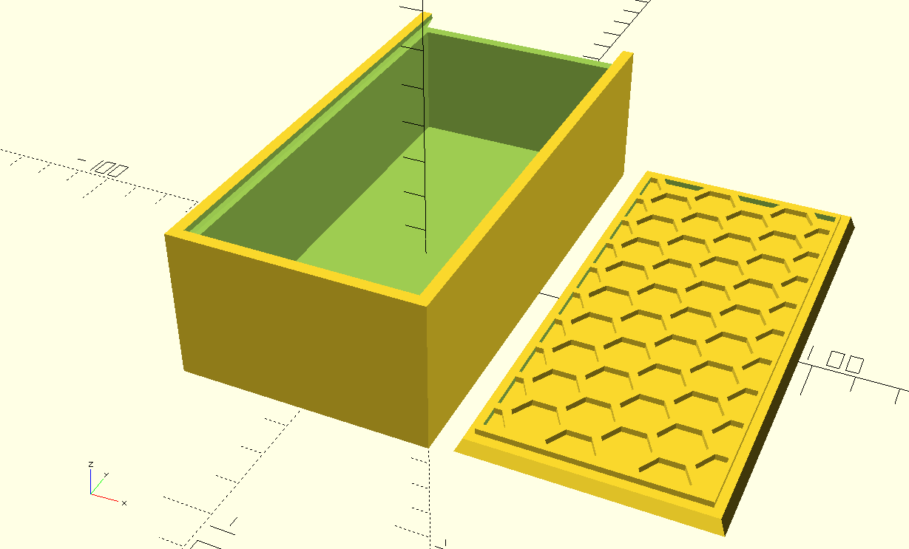

# OpenSCAD Sliding Lid Box with Honeycomb Grip

## Features

*  parameters for box length, width, height
*  parameters for honeycomb size & wall thickness
*  option for a button on the lid instead of the honeycomb pattern
*  option for reinforcement columns in middle of box length

## Render

